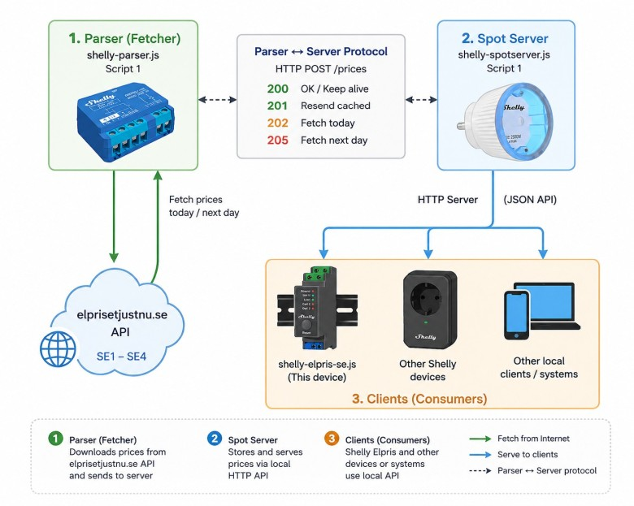
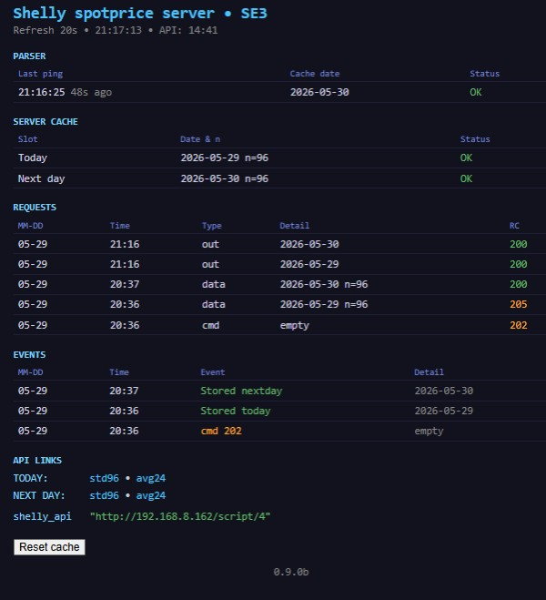

# shelly-local-pricehub

Local electricity price hub for Shelly devices.

Fetch, cache, transform and distribute spot electricity prices inside your local network.


## Overview

shelly-local-pricehub is a lightweight two-device architecture designed for Shelly devices.

The system separates electricity price acquisition from price distribution:

- **shelly-parser** downloads and parses data from elprisetjustnu.se

- **shelly-spotserver** stores, serves and distributes prices to local clients

This approach allows memory-intensive parsing to be isolated from client devices while keeping compatibility with existing Shelly automation scripts.


## Why this project exists

The original shelly-elpris-se architecture was designed to stay entirely within the Shelly ecosystem, without relying on external servers or databases.

For Nordic price areas such as FI, EE, LV and LT, this approach works well because Elering provides compact CSV datasets that fit comfortably into Shelly memory.

Swedish SE1-SE4 price data presents a different challenge.

The 15-minute JSON datasets provided by [elprisetjustnu.se](https://www.elprisetjustnu.se/elpris-api) are typically around 13-14 kB and cannot be processed using the traditional "download entire response and parse it" approach on Shelly devices.

To remain within the Shelly ecosystem, this project uses:

* a dedicated parser device
* character-by-character JSON parsing
* a separate local price server

This architecture allows large Swedish price datasets to be processed without introducing external infrastructure such as Raspberry Pi, NAS servers or cloud services.

The output format remains compatible with the [se.elpris.eu](https://se.elpris.eu) API format, with additional metadata used for local distribution:

```text
{
  "via":"shelly-parser",
  "z":"SE3",
  ...
}
```

This allows existing Shelly scripts, including [shelly-elpris-se](https://github.com/Soviet9773Red/shelly-elpris-se), to use locally distributed price data without modifications.

The result is a fully local energy-management solution built entirely on Shelly devices, without requiring Raspberry Pi, NAS systems, Docker hosts or dedicated servers.

The entire solution remains within the Shelly ecosystem while preserving compatibility with existing installations.


## Architecture

<p align="center">
  
</p>

The basic data flow is:

```text
elprisetjustnu.se
        │
        ▼
   shelly-parser
        │
        ▼
 shelly-spotserver
        │
 ┌──────┼──────┐
 ▼      ▼      ▼
Shelly  API   Other
Elpris Clients
```


## Components

### shelly-parser

Responsibilities:

- Fetches electricity prices from elprisetjustnu.se

- Handles DST days (92 / 96 / 100 intervals)

- Maintains local cache

- Communicates with the server using a lightweight parser protocol

- Provides zone metadata (SE1-SE4)

### shelly-spotserver

Responsibilities:

- Receives datasets from parser

- Stores today and tomorrow prices

- Provides local JSON API

- Generates hourly average datasets (avg24)

- Monitors parser connectivity

- Includes a built-in dashboard


## Features

- Local electricity price cache

- No cloud dependency after data retrieval

- Built-in dashboard

- Parser watchdog

- Automatic day rollover

- Support for SE1-SE4

- DST-safe handling

- Compatible with Shelly Gen2 / Gen3 / Gen4 devices

- Compatible with shelly-elprisSE 3.2+


## API

### Prices

```text
Standart format, 15 min
http://device-ip/script/id/?r=prices&d=YYYY-MM-DD 

Averaged 24h format 
http://device-ip/script/id/?r=prices&d=YYYY-MM-DD&avg24

```

### Dashboard

```text
http://device-ip/script/id/
```

### Status JSON

```text
http://device-ip/script/id/?r=ui
```

### Response format

The Spot Server returns datasets compatible with the se.elpris.eu API format.

Standard 15-minute dataset example:

```text
{
  "src": "Elprisetjustnu.se",
  "via": "shelly-parser",
  "z": "SE3",
  "t0": "2026-05-27T00:00:00+02:00",
  "s": 900,
  "u": "SEK",
  "raw": 96,
  "p": [[0.58146,..., 0.79293]
}
```

Fields:

| Field | Description                |
| ----- | -------------------------- |
| src   | Original data source       |
| via   | Local parser identifier    |
| z     | Price zone (SE1-SE4)       |
| t0    | Dataset start timestamp    |
| s     | Interval length in seconds |
| u     | Price unit                 |
| raw   | Number of source intervals |
| p     | Price array                |

This format was intentionally designed to remain compatible with the se.elpris.eu API while adding local metadata required for parser/server operation.


## Integration with shelly-elpris-se

shelly-elpris-se 3.2+ can operate in two modes:

### Cloud mode

```text
shelly-elpris-se
        │
        ▼
   se.elpris.eu
```

### Local mode

```text
shelly-elpris-se
        │
        ▼
shelly-spotserver
        │
        ▼
  shelly-parser
        │
        ▼
 elprisetjustnu.se
```

Switching between modes requires changing a single configuration variable in shelly-elpris-se:

```javascript
let shelly_api = ""; // Cloud mode (se.elpris.eu)

For local mode:
let shelly_api = "http://ip/script/id";
```

When shelly_api is empty, shelly-elpris-se uses the public se.elpris.eu API.<br>
When shelly_api contains a Spot Server URL, all price requests are routed through the local Shelly Price Hub.

## Repository structure

```text
shelly-local-pricehub/

├── parser/
│   └── shelly-parser.js
│
├── server/
│   └── shelly-spotserver.js
│
├── docs/
│   ├── architecture.png
│   └── dashboard.png
│
└── README.md
```


## How it works

The solution uses three separate Shelly devices:

1. **shelly-parser.js** - downloads and processes raw price data from elprisetjustnu.se.
2. **shelly-spotserver.js** - stores processed price data locally and serves it through a lightweight HTTP API.
3. **shelly-elpris-se.js** - requests already processed prices from the local server and performs relay control logic.

Separating the parser and server onto different devices prevents heavy JSON processing from affecting the main controller.

## Startup sequence

1. Start [shelly-spotserver.js](shelly-spotserver.js).
2. Note the URL shown in the server console:

   ```
   Parser s = http://<ip>/script/<id>/prices
   ```
3. Configure this URL in [shelly-parser.js](shelly-parser.js).
4. Start [shelly-parser.js](shelly-parser.js).
5. The parser and server will automatically exchange status messages and synchronize today's and tomorrow's price data.

### Synchronization timing

The parser and server synchronize gradually after startup.

* The parser contacts the server every 60 seconds.
* The Server UI refreshes every 20 seconds.
* Today and next-day datasets are transferred in separate stages.

As a result, it may take approximately 2-3 minutes after startup before both today's and tomorrow's prices are fully available on the Spot Server.

This behaviour is normal and indicates that the parser and server are exchanging and validating datasets.

## Parser console

Example:

```text
shelly-parser 0.9.0
SE3 | Server: http://192.168.8.162/script/4/prices

Server: 202 - fetch today
Fetch: https://www.elprisetjustnu.se/...
Cached t0=2026-05-29T00:00:00+02:00 (96 prices)
POST 2026-05-29, 811B

Server: 205 - fetch nextday
Fetch: https://www.elprisetjustnu.se/...
Cached t0=2026-05-30T00:00:00+02:00 (96 prices)
POST 2026-05-30, 810B
```

Meaning:

* **202** - server requests today's prices.
* **205** - server requests tomorrow's prices.
* **Cached** - price data successfully parsed and stored in parser memory.
* **POST** - processed data successfully transferred to the server.

## Server console

Example:

```text
Shelly spotprice server 0.9.0b

[ping] waiting...
[ping] parser=empty

Stored today: 2026-05-29 (96)
Stored nextday: 2026-05-30 (96)

[ping] parser=2026-05-30
```

Meaning:

* **parser=empty** - parser connected but has no cached prices yet.
* **Stored today** - today's prices received and stored.
* **Stored nextday** - tomorrow's prices received and stored.
* **parser=YYYY-MM-DD** - parser reports which dataset is currently cached.

## Server UI

The Spot Server includes a built-in web interface (Server UI) for monitoring parser activity and stored price data.

The Server UI address is displayed in the server console during startup:

```text
Server UI: http://device-ip/script/id/
```

Open this address in your browser to access the dashboard.

The Server UI displays:

- Server status
- Active price zone
- Today and tomorrow datasets
- Parser communication status
- Last parser update
- API information and diagnostics
- History of the last 8 HTTP requests / server events

<p align="center">  </p>


## Important note about parser performance

The parser performs memory-intensive JSON processing.

During a fetch operation the parser device may become unresponsive for approximately **15-20 seconds**. While processing data it may not answer HTTP requests, update the web UI, or react to user actions.

This behaviour is normal and is the primary reason why the parser is intended to run on a **dedicated Shelly device**.

The server device remains responsive during this period and continues serving cached price data to clients.


## License

MIT License